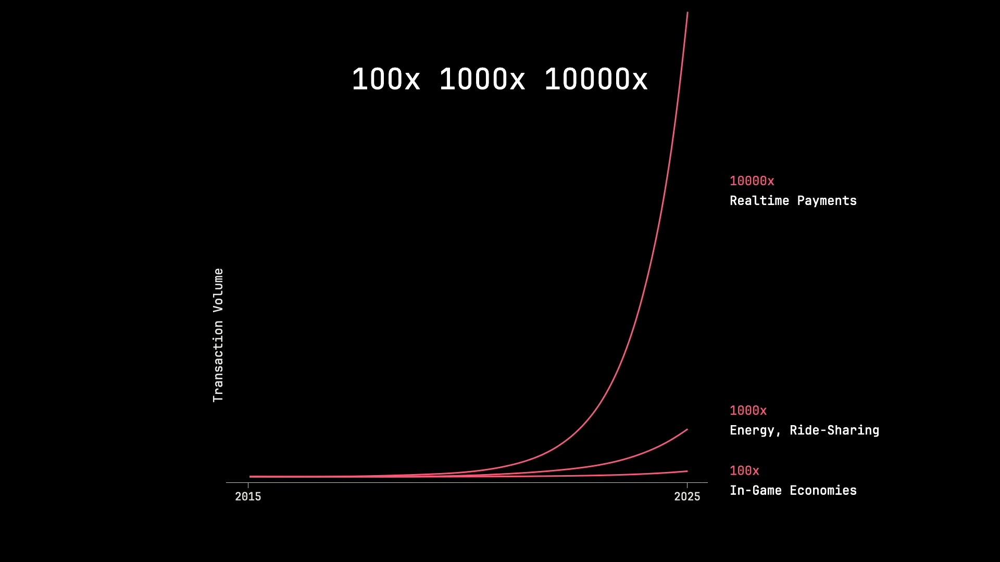
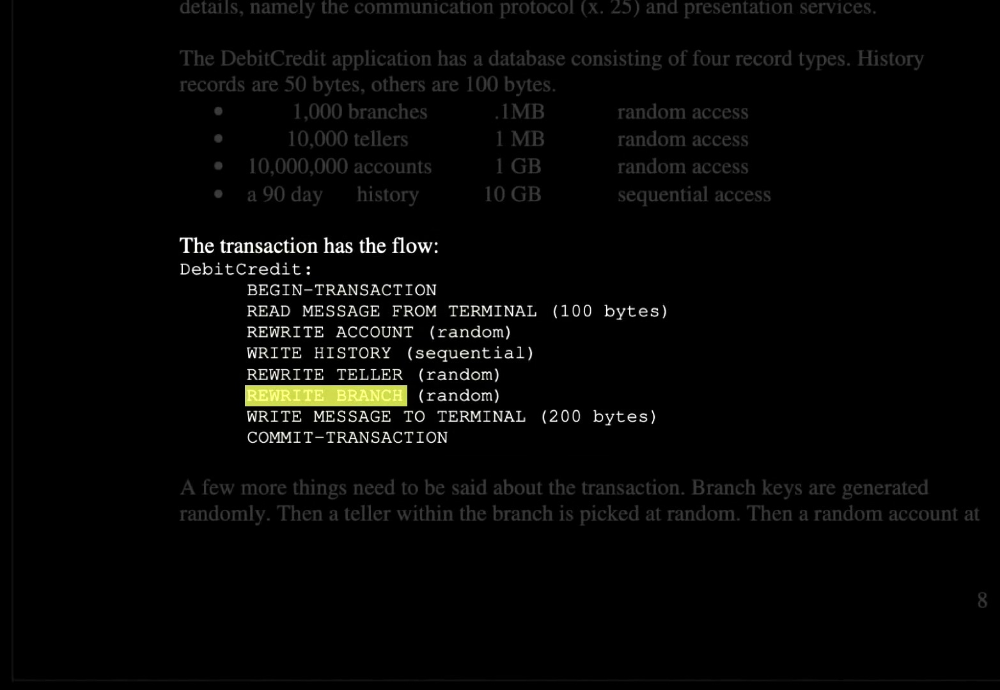
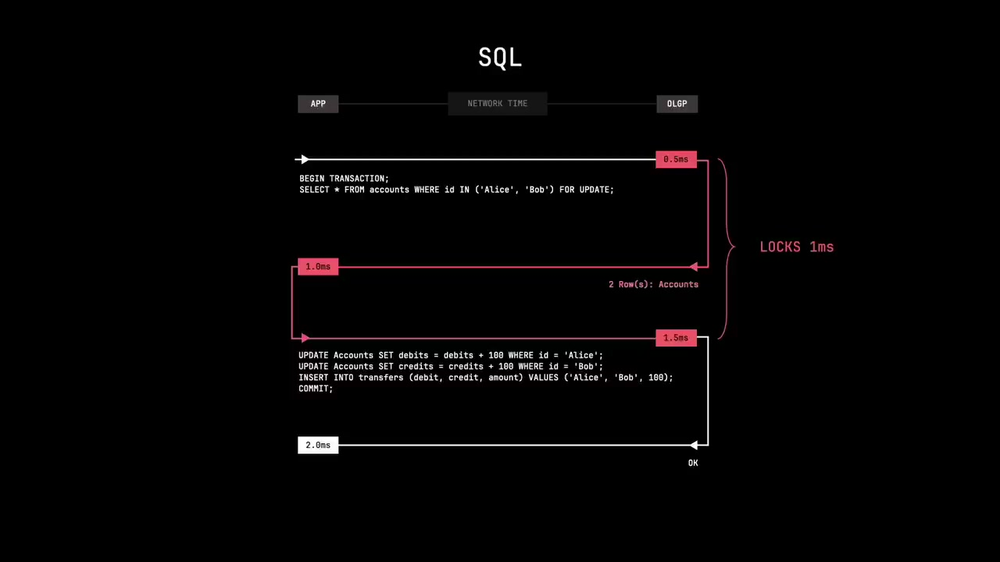
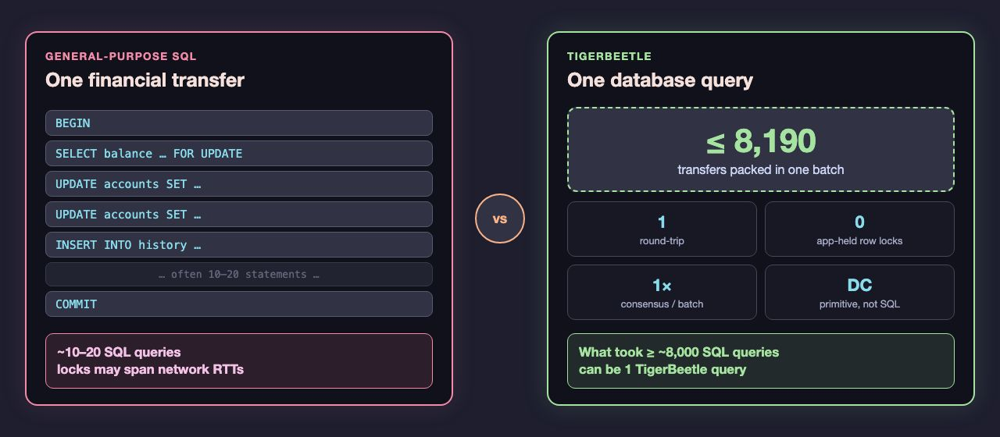
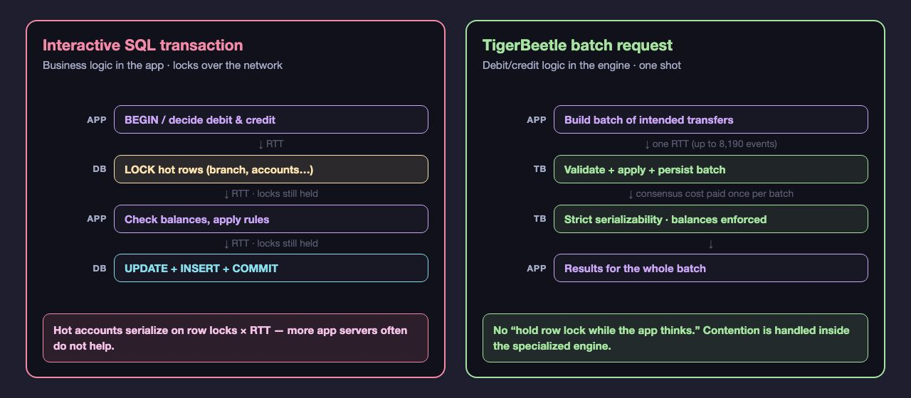

<!-- _class: lead -->

# Exploring TigerBeetle

## Debit/Credit Transactions in Conventional Databases vs. First-Class Primitives

### Part of the ongoing Designing Ultra Large Scale Systems study group

---

<!-- _class: build -->

## Who am I?

[**Craig Rodrigues**](https://www.linkedin.com/in/rodrigc)  
Software Engineer in Silicon Valley

- Interested in distributed systems
- Interested in studying interesting topics in this space
- Building a community of like-minded people where we can study together and learn

---

<!-- _class: build -->

## Why This Study Group?

I was inspired to start this study group after taking [Chiradip Mandal](https://www.linkedin.com/in/chiradip/)'s course:

[Data Algorithms](https://chiradip.com/courses/data-algorithms/)

Mastering this topic requires constant study and review of:

- Papers
- Algorithms
- Cutting-edge implementations

---

<!-- _class: build -->

## Guiding Principles

We choose presentations that:

1. **No product pitches** — substance over sales
2. **Adhere to computer science fundamentals** — grounded in first principles
3. **Interesting claims must be verifiable** — papers, code, benchmarks, not vibes
4. **Solve a specific problem that can help the industry at large** — transferable lessons, not navel-gazing

---

<!-- _class: build -->

## Study Group — and Tech Evaluation & Critique

We are a **study group**: we learn together from papers, systems, and implementations.

We also act as a **tech evaluation and critique** group:

- Examine claims carefully — architecture, performance, correctness
- Ask hard questions: what works, what doesn’t, under what assumptions?
- Separate marketing from engineering substance
- Leave with a clearer judgment of when a technology is (or isn’t) a fit

---

<!-- _class: build -->

## Study Group Structure

- Before the meeting: participants are encouraged to study the prerequisite material
- During the event: first 30 minutes presentation, next ~20 minutes open discussion
- Follow-up discussion on the Designing Ultra Large Scale Systems Discord

---

<!-- _class: build -->

## Pre-work Materials

1. [Read: Kyle Kingsbury's analysis of TigerBeetle](https://jepsen.io/analyses/tigerbeetle-0.16.11)
2. [Read: Joran Greef's blog post](https://tigerbeetle.com/blog/2024-07-23-rediscovering-transaction-processing-from-history-and-first-principles/)
3. [Review: TigerBeetle system architecture docs](https://docs.tigerbeetle.com/coding/system-architecture/)
4. [Read: Jim Gray's paper "A Measure of Transaction Processing Power"](https://jimgray.azurewebsites.net/papers/AMeasureOfTransactionProcessingPower.pdf) (defines the classic debit/credit benchmark)
5. [Watch: "1000x: The Power of an Interface for Performance" by Joran Dirk Greef (~1hr)](https://www.youtube.com/watch?v=yKgfk8lTQuE) (Joran discusses the SQL implementation and this paper)

---

<!-- _class: build -->

## [TigerBeetle](https://tigerbeetle.com)

- A financial transactions database purpose-built for high-performance OLTP
- Reimagines debit/credit as a **first-class primitive** (not just SQL queries and locks)
- Aims for massive gains in correctness, safety, and speed at scale

---

<!-- _class: build -->

## [TigerBeetle](https://tigerbeetle.com)

- Strict consistency with double-entry bookkeeping built-in
- Batch thousands of transfers per query; eliminates traditional contention bottlenecks
- Designed from first principles: durability, multi-cloud availability, extreme throughput

---

<!-- _class: build -->

## What We'll Cover

- What a debit/credit is in a financial system
- How debit/credit is implemented in traditional SQL (as defined in Jim Gray's paper [A Measure of Transaction Processing Power](https://jimgray.azurewebsites.net/papers/AMeasureOfTransactionProcessingPower.pdf))
- Existing problems and scalability limitations
- How TigerBeetle models schema (spoiler: **no schema language**)
- Comparison with TigerBeetle’s transfer-first interface
- Performance vs general-purpose SQL (interface, batching, contention)

---

<!-- _class: diagram -->

## What is a Debit / Credit?

<video src="assets/debit-credit-transfer.webm" autoplay loop muted playsinline></video>

<div class="diagram-caption">

**Debit** − Account A $100 → $99 &nbsp;→&nbsp; **Credit** + Account B $50 → $51

</div>

---

<!-- _class: diagram -->

## Trends in Debit / Credit volumes



<div class="diagram-caption">

[Joran Dirk Greef, “1000×…”](https://www.youtube.com/watch?v=yKgfk8lTQuE&t=753s) — realtime payments ≈ **10,000×** over a decade

</div>

---

<!-- _class: build -->

## Instant Payment Systems

National-scale real-time rails — debit/credit at country scale:

- **India — UPI** (Unified Payments Interface)
- **Brazil — PIX**
- **U.S. — The Clearing House RTP**, Federal Reserve **FedNow**

<div class="stat-callout">

<div class="stat-label">India UPI · order of magnitude</div>

<div class="stat-row">
<span class="stat"><strong>~16 billion</strong><em>transfers / month</em></span>
<span class="stat"><strong>~6,000</strong><em>TPS average</em></span>
</div>

<div class="stat-cite">

Source: [NPCI UPI product statistics](https://www.npci.org.in/what-we-do/upi/product-statistics) · as cited in [Jepsen: TigerBeetle 0.16.11](https://jepsen.io/analyses/tigerbeetle-0.16.11)

</div>

</div>

---

<!-- _class: diagram -->

## Gray (1985): DebitCredit — the Hot Branch



<div class="diagram-caption">

From [“1000×: The Power of an Interface for Performance”](https://www.youtube.com/watch?v=yKgfk8lTQuE&t=482s) (Joran Dirk Greef). Branch ≈ **hot account** — contention is the point of the benchmark.

</div>

---

<!-- _class: build -->

## DebitCredit Benchmark

Jim Gray, [*A Measure of Transaction Processing Power*](https://jimgray.azurewebsites.net/papers/AMeasureOfTransactionProcessingPower.pdf) (1985)

The canonical OLTP workload and measure of "transactions per second".

**Gray’s DebitCredit pseudocode:**

<pre class="pseudocode"><code>DebitCredit:
  BEGIN-TRANSACTION
    READ MESSAGE FROM TERMINAL (100 bytes)
    REWRITE ACCOUNT (random)
    WRITE HISTORY (sequential)
    REWRITE TELLER (random)
    <mark class="hot-spot">REWRITE BRANCH</mark> (random)
    WRITE MESSAGE TO TERMINAL (200 bytes)
  COMMIT-TRANSACTION</code></pre>

---

<!-- _class: build -->

## DebitCredit Benchmark

Database scale in Gray’s paper (scaled with TPS):

| Record type | Count (at peak scale) | Access pattern |
| --- | --- | --- |
| Branch | 1,000 | random rewrite |
| Teller | 10,000 | random rewrite |
| Account | 10,000,000 | random rewrite |
| History | 90-day trail | sequential write |

Every transaction rewrites **one** account, **one** teller, and **one** branch — plus appends history.

---

<!-- _class: build -->

## DebitCredit Benchmark

**Sample SQL implementation — debit:**

```sql
BEGIN TRANSACTION;

-- Debit one account
UPDATE accounts
SET balance = balance - :amount
WHERE id = :from_id;
```

---

<!-- _class: build -->

## DebitCredit Benchmark

**Sample SQL implementation — credit & history:**

```sql
-- Credit another account
UPDATE accounts
SET balance = balance + :amount
WHERE id = :to_id;

-- Record history (double-entry)
INSERT INTO history (from_id, to_id, amount, ts)
VALUES (:from_id, :to_id, :amount, NOW());

COMMIT;
```

---

<!-- _class: lead -->

## What's Wrong With This Picture?

### Issues Joran Dirk Greef highlights for SQL debit/credit

[1000x: The Power of an Interface for Performance](https://www.youtube.com/watch?v=yKgfk8lTQuE&t=2609s)  
[Rediscovering Transaction Processing From History and First Principles](https://tigerbeetle.com/blog/2024-07-23-rediscovering-transaction-processing-from-history-and-first-principles/)

---

<!-- _class: build -->

## Impedance Mismatch

One **financial** transfer ≠ one database round-trip.

- For each debit/credit, a general-purpose DB often runs **10–20 SQL queries**
- Data moves to the app over the network; the app decides; results are written back
- Balance checks, updates, and history inserts are separate statements — not one primitive

---

<!-- _class: diagram -->

## SQL Sequence Holds Locks Across RTTs



<div class="diagram-caption">

From [Joran’s talk (~18:29)](https://youtu.be/yKgfk8lTQuE?t=1109): locks held across network time while the app decides.

</div>

---

<!-- _class: build -->

## Locks × Network RTT

Concurrency control collides with distributed reality.

- Row locks are held **while waiting on the network**
- Even a few RTTs per transfer cap how many transfers can touch the same rows per second
- More hardware does not fix this — the limit is structural, not just “CPU is too slow”
---

<!-- _class: build -->

## REWRITE BRANCH → Hot Account Contention

Gray’s pseudocode routes **every** transaction through a branch row.

- **10M** customer accounts, but only **1K** branches (and few tellers)
- `REWRITE BRANCH` is on the critical path of almost every DebitCredit
- That branch row becomes a **hot account**: locked by nearly all concurrent transfers
- Result: **effective serialization** — app-tier scale-out cannot remove a single-row bottleneck

Joran’s point in the talk: OLTP is characterized by this intrinsic contention, not just random I/O.
---

<!-- _class: build -->

## Correctness Lives Outside the Database

Business rules are reimplemented in application code.

- “Enough balance?”, pending funds, timeouts, double-entry invariants → **app-layer**
- Easy to get wrong under retries, partial failures, and concurrent transfers
- The DB guarantees ACID for SQL statements — not debit/credit **as a domain**

---

<!-- _class: build -->

## The World Got More Transactional

General-purpose OLTP designs are decades old; demand is not.

- Instant payments, gaming economies, energy, per-second cloud billing, …
- Orders of magnitude more transfers — same fundamental row-lock + RTT model
- Joran’s thesis: fix the **interface** (debit/credit as a first-class primitive), not only the engine

---

<!-- _class: lead -->

## TigerBeetle’s Answer

### Not a better Postgres — a **different kind** of database

Debit/credit is the product, not an application pattern on top of SQL.

---

<!-- _class: build -->

## Specialize the Database

TigerBeetle is **not** a general-purpose OLTP store.

- Not “Postgres, but faster for money”
- Purpose-built for **accounts**, **transfers**, and balances
- Designed to sit **beside** a general-purpose DB (Postgres, etc.), not replace it

See: [System architecture](https://docs.tigerbeetle.com/coding/system-architecture/)

---

<!-- _class: lead -->

## What language specifies the schema?

### Short answer: **none.**

There is no schema language — and that is a deliberate design choice.

---

<!-- _class: build -->

## Not SQL — and not “schema-less”

In a general-purpose database you **declare** structure:

```sql
CREATE TABLE accounts (...);
CREATE TABLE transfers (...);
ALTER TABLE ... ADD COLUMN ...;
```

That is **DDL** (Data Definition Language): you invent tables, columns, and migrations.

TigerBeetle has **no DDL**, no migrations, no user-defined tables.

---

<!-- _class: build -->

## The Schema Is Fixed — Built Into the Product

TigerBeetle ships with a **universal, fixed schema** for double-entry bookkeeping.

| Entity | Role |
| --- | --- |
| **Ledger** | Partition (e.g. currency / asset group) — a **number**, not a table you create |
| **Account** | A balance holder (who holds value) |
| **Transfer** | Move value: debit one account, credit another |

You do **not** design tables.  
You **use** the tables the database already is.

See: [Data modeling](https://docs.tigerbeetle.com/coding/data-modeling/)

---

<!-- _class: build -->

## Debit/Credit = The Universal Schema

TigerBeetle’s claim: debit/credit is **minimal and complete** for exchanges of value.

- Two entity kinds: **accounts** and **transfers**
- One invariant: every debit has an equal and opposite credit
- Same shape for payments, refunds, FX legs, reservations, … any product line

New product feature → usually **new `code`s / accounts**, not `ALTER TABLE`.

---

<!-- _class: build -->

## Fixed Fields, Fixed Sizes

Each record has a **closed set of fields** (fixed-width integers, not free-form rows).

**Account** (conceptually): `id`, ledger, code, flags, debits/credits, `user_data_*`, timestamp

**Transfer** (conceptually): `id`, debit account, credit account, amount, ledger, code, flags, `user_data_*`, timestamp

- No arbitrary strings in the hot path
- No “add a JSON column later”
- Immutability + fixed layout → simpler correctness and performance

---

<!-- _class: build -->

## How Do You “Configure” Types Then?

Soft typing with **integers** — meanings live in the app / OLGP DB.

| Human meaning | In TigerBeetle |
| --- | --- |
| Currency “USD” | `ledger = 1` (or another number you choose) |
| Account type “customer cash” | account `code = 1001` |
| Transfer reason “refund” | transfer `code = 42` |

Map numbers ↔ names in your control-plane DB (or hard-code enums).  
**Never** fetch that metadata on the hot transfer path.

See: [Ledger, account, and transfer types](https://docs.tigerbeetle.com/coding/system-architecture/#ledger-account-and-transfer-types)

---

<!-- _class: build -->

## You Speak an API — Not a Schema Language

[Clients](https://docs.tigerbeetle.com/coding/clients/) call fixed operations:

- `create_accounts` / `create_transfers`
- Lookups and queries by id / filter

```javascript
// Not CREATE TABLE — create *instances* of the fixed Account type
client.createAccounts([
  { id: 1n, ledger: 1, code: 1, flags: 0 }, // Account A
  { id: 2n, ledger: 1, code: 1, flags: 0 }, // Account B
]);
```

---

<!-- _class: build -->

## Debit / Credit as a First-Class Primitive

The interface *is* the domain model.

| General-purpose SQL | TigerBeetle |
| --- | --- |
| You design schema with DDL | Schema is **fixed** (accounts + transfers) |
| `UPDATE` + `INSERT` + app logic | **Transfer** between two accounts |
| Balance is a column you mutate | Balance is **derived / enforced** by the engine |
| Double-entry is a convention | Double-entry is **built in** |

One API call ≈ one business transfer — not a pile of SQL statements.

---

<!-- _class: build -->

## DebitCredit in TigerBeetle

Same idea as Jim Gray’s DebitCredit — but as a **single transfer primitive**, not multi-statement SQL.

**Transfer $1** from Account A → Account B (one request):

```javascript
client.createTransfers([{
  id: id(),                  // idempotency key
  debit_account_id: 1n,      // Account A (from)
  credit_account_id: 2n,     // Account B (to)
  amount: 1n,                // $1 (or 100n for cents)
  ledger: 1,
  code: 1,                   // app-defined reason
}]);
```

No separate `UPDATE` balance, no history `INSERT` — the engine debits, credits, and records the transfer atomically.

---

<!-- _class: build -->

## Fix the Impedance Mismatch

Move the work **into** the database boundary.

- Pack **thousands** of transfers in a single query (batching)
- Amortize network RTTs: many financial txs per round-trip
- Application submits intent; engine applies debit/credit atomically

Before: ~10–20 SQL queries per transfer  
After: up to **thousands of transfers per query**

---

<!-- _class: build -->

## Eliminate the Row-Lock Trap

Specialization enables a different execution model.

- No classic “hold row locks while the app thinks over the network”
- Engine processes a batch of transfers in one place, with **strict serializability**
- Hot accounts still exist — but the design is built for that contention pattern

Performance comes from the **interface**, not only from faster disks.

---

<!-- _class: build -->

## Correctness Inside the Engine

Domain rules are features, not app boilerplate.

- Double-entry bookkeeping enforced by the database
- Balance limits / insufficient funds rejected by the engine
- Pending transfers, timeouts, post/void — financial workflow as primitives

Fewer places for “almost correct” money code in the application.

---

<!-- _class: build -->

## Split the Planes

Use the right tool for each job — including **where schema lives**.

| Hot path (data plane) | Cold path (control plane) |
| --- | --- |
| **TigerBeetle** — fixed account/transfer schema | **OLGP** (e.g. Postgres) — users, names, type maps |
| High TPS, strict financial invariants | Flexible DDL, strings, reporting joins |

TigerBeetle records *who moved how much*; the general-purpose DB stores *who they are* and what `ledger`/`code` mean.

---

<!-- _class: build -->

## The Idea in One Line

> Don’t model debit/credit **in** a general-purpose database.  
> Make a database whose **core abstraction** *is* debit/credit.

That is how TigerBeetle attacks impedance mismatch, lock×RTT limits, and domain correctness at once.

---

<!-- _class: lead -->

## Performance: Why Does This Matter?

Debit/credit specialization is not only about elegance —  
it changes **queries × RTTs × locks**, which is where OLTP throughput dies.

---

<!-- _class: diagram -->

## The “1000×” Interface Idea



<div class="diagram-caption">

From [Joran’s talk](https://www.youtube.com/watch?v=yKgfk8lTQuE) and [TigerBeetle’s blog](https://tigerbeetle.com/blog/2024-07-23-rediscovering-transaction-processing-from-history-and-first-principles/): pack debit/credits so one RTT does thousands of financial txs.

</div>

---

<!-- _class: diagram -->

## Interactive SQL vs In-Engine Batch



<div class="diagram-caption">

See also: [Performance — It’s All About The Interface](https://docs.tigerbeetle.com/concepts/performance/)

</div>

---

<!-- _class: tps-slide -->

## Debit/Credit TPS — Postgres vs TigerBeetle

Debit/credit workload · **10% contention** · from [Joran’s talk](https://www.youtube.com/watch?v=yKgfk8lTQuE&t=2840s)

<div class="tps-compare"><div class="tps-card tps-sql"><div class="tps-name">Postgres</div><div class="tps-value">~1,600</div><div class="tps-unit">TPS top speed</div><div class="tps-note">single machine · no replication</div></div><div class="tps-vs">~266×</div><div class="tps-card tps-tb"><div class="tps-name">TigerBeetle</div><div class="tps-value">~400,000</div><div class="tps-unit">TPS peak</div><div class="tps-note">4-node cluster · full consensus</div></div></div>

---

<!-- _class: build -->

## Performance — Takeaways for Debit/Credit

| Lever | General-purpose DB (e.g. Postgres) | TigerBeetle |
| --- | --- | --- |
| **Unit of work** | SQL statements / interactive tx | Debit/credit **transfer** batch |
| **Network** | Many RTTs; locks may span them | One RTT per batch (≤ 8,190) |
| **Contention** | Hot rows serialize × RTT | Specialized path; no app-held row locks |
| **Scale model** | Scale-out / shards (hard when hot) | **Scale-up** primary; replicas for HA |
| **What to measure** | TPS under *your* hot accounts | Same — plus batch size & end-to-end latency |

Independent benches vary (often multi-×, not always 1000× wall-clock). The structural claim is: **fix the impedance mismatch, then engineer the hot path.**

---

<!-- _class: build -->

## Acknowledgments

Thank you:

- **Chiradip Mandal** — https://chiradip.com  
  Inspiration for this study group and for deep study of data algorithms
- **Joran Dirk Greef** and the TigerBeetle team — https://tigerbeetle.com  
  Ideas, writings, and talks on debit/credit as a first-class primitive
- **Kyle Kingsbury** — https://jepsen.io  
  Independent analysis that helps us evaluate systems carefully

---

<!-- _class: build -->

## Acknowledgments (AI)

These slides were prepared with the help of **Grok AI**.

---

<!-- _class: build -->

## Homework (optional)

- **Read Gray’s paper** — [A Measure of Transaction Processing Power](https://jimgray.azurewebsites.net/papers/AMeasureOfTransactionProcessingPower.pdf) — and reproduce DebitCredit in SQL on a database like **Postgres**
- **Read the [TigerBeetle docs](https://docs.tigerbeetle.com/)**, set up TigerBeetle, and implement a simple debit/credit
- **Share** your efforts and results on the Designing Ultra Large Scale Systems **Discord**

---

<!-- _class: build -->

## Upcoming Meetings

- **August:** Exploring TigerBeetle: Viewstamped Replication (VR) consensus protocol
- **September:** Using Antithesis for exploring state spaces and fault injection

---

<!-- _class: build -->

## Stay in touch!

- **Craig Rodrigues**  
  LinkedIn: https://linkedin.com/in/rodrigc  
  Discord: @CraigRodrigues

- **Chiradip Mandal**  
  LinkedIn: https://www.linkedin.com/in/chiradip/  
  Discord: @Chiradip Mandal
