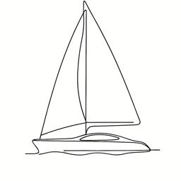

<table>
<tr>
<td width="72" valign="middle">

</td>
<td valign="middle">

# Designing Ultra Large Scale Systems Study Group

</td>
</tr>
</table>

A community for engineers who want to go deep on distributed systems, data algorithms, and production-scale designs — through papers, code, and careful critique.

We study systems together. We also evaluate them: architecture, performance, correctness, and when a technology is (or isn’t) a fit.

---

## Discord

Meetings and presentations are held on Discord. We also have ongoing discussions there between sessions.

**Invite:** https://discord.gg/C2aTuavXeU

---

## Presentations

<table>
<tr>
<td>

| # | Title | Date | Source |
| ---: | --- | --- | --- |
| 001 | [Exploring TigerBeetle: Debit/Credit Transactions in Conventional Databases vs. First-Class Primitives](https://space-rf-org.github.io/dulss-study-group/001/slides.html) | July 15, 2026 | [`001/`](./001/) |
| 002 | Exploring TigerBeetle, part 2: Viewstamped Replication (VR) Consensus Protocol | August 19, 2026 | — |

</td>
</tr>
</table>

### Upcoming events

- **Exploring TigerBeetle, part 2: Viewstamped Replication (VR) Consensus Protocol** — August 19, 2026  
  Sign up: https://luma.com/q52i04r2

---

## Guiding Principles

We choose presentations that:

1. **No product pitches** — substance over sales
2. **Adhere to computer science fundamentals** — grounded in first principles
3. **Interesting claims must be verifiable** — papers, code, benchmarks, not vibes
4. **Solve a specific problem that can help the industry at large** — transferable lessons, not navel-gazing

---

## How We Work

We are a **study group**: we learn together from papers, systems, and implementations.

We also act as a **tech evaluation and critique** group:

- Examine claims carefully — architecture, performance, correctness
- Ask hard questions: what works, what doesn’t, under what assumptions?
- Separate marketing from engineering substance
- Leave with a clearer judgment of when a technology is (or isn’t) a fit

### Meeting structure

| Phase | What happens |
| --- | --- |
| **Before** | Participants are encouraged to study the prerequisite material |
| **During** | ~30 minutes presentation, then ~20 minutes open discussion |
| **After** | Follow-up discussion on the Designing Ultra Large Scale Systems Discord |

---

## Stay in touch

- **Craig Rodrigues** — [LinkedIn](https://www.linkedin.com/in/rodrigc) · Discord: `@CraigRodrigues`
- **Chiradip Mandal** — [LinkedIn](https://www.linkedin.com/in/chiradip/) · Discord: `@Chiradip Mandal`
